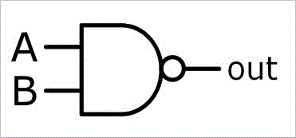
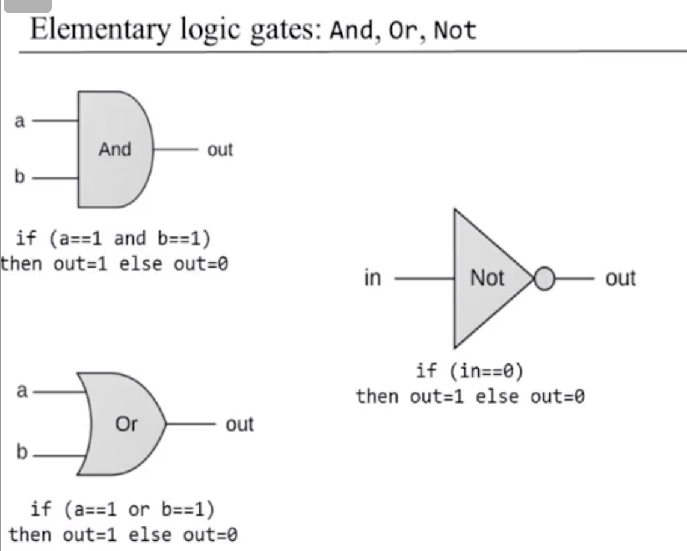
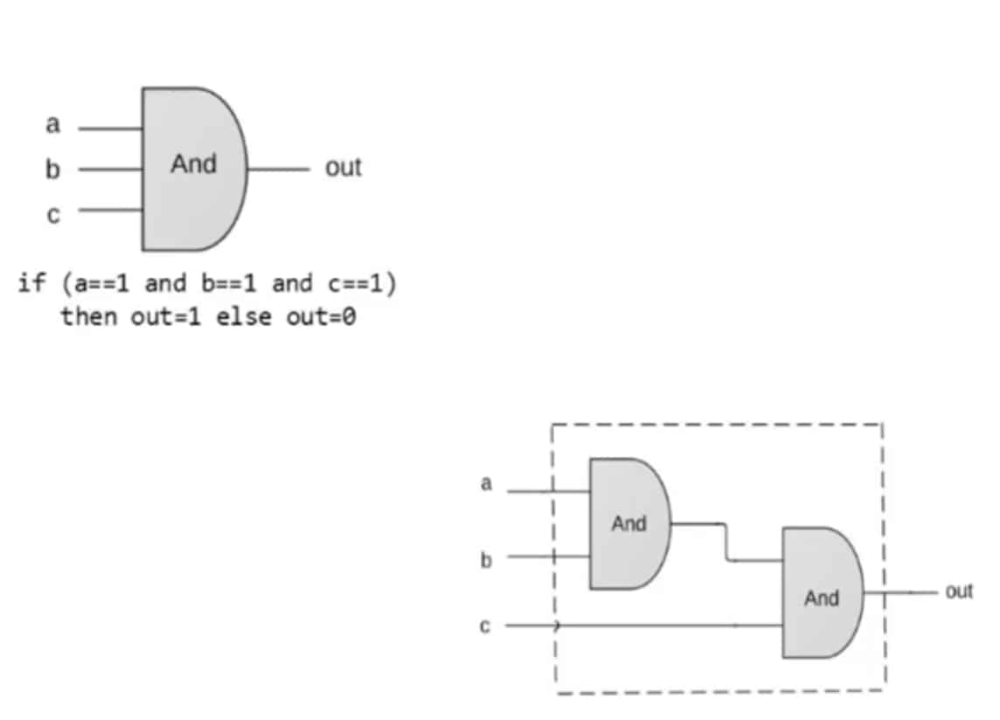
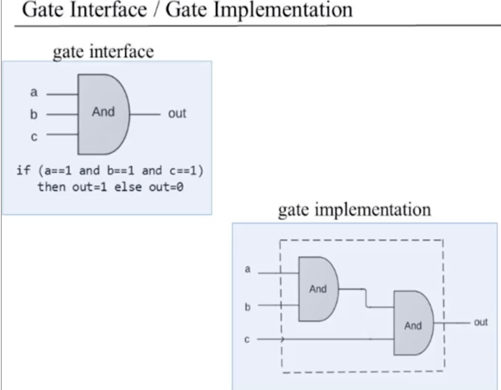
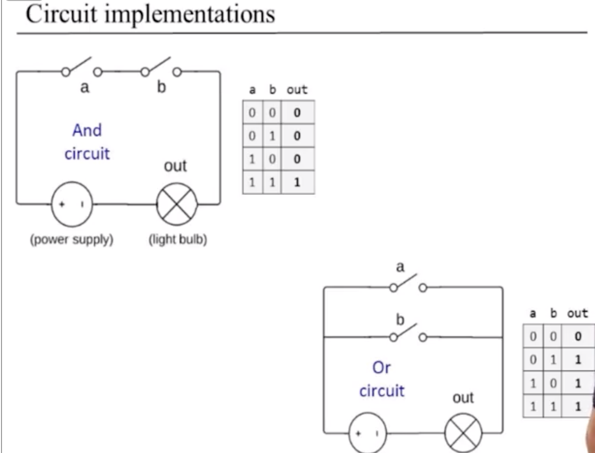
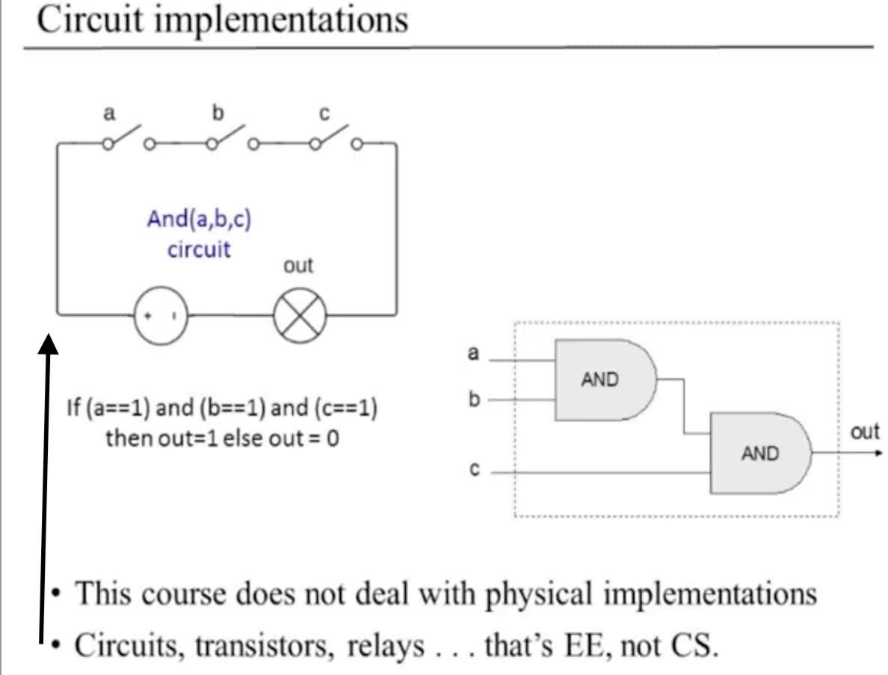
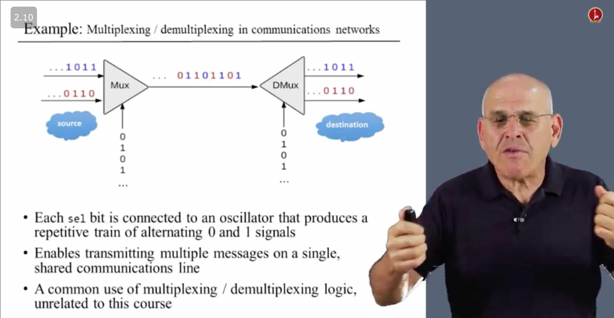

TODO: use TSDX for the assembler portion of the projects

From Nand to Tetris:

**Boolean Functions and Gate Logic**
- computers programs ultimately run just 0 & 1’s. Why?  It's simplest to have only two possible values that you need to maintain.


**Key terms**
Binary Number System: 
- In computer science, a binary system is a number system that has just two unique digits: 0 and 1.
Base 2 Number System: 
- A number system where we only have two possible values. Ex: 0 & 1.
Boolean Value: 
- a value that is either true or false
Boolean Logic: 
- a form of algebra in which all values are reduced to either TRUE or FALSE


Why do we use binary system when dealing with computers (some not all reasons)?
- the binary system is more natural because of its electrical nature (charged versus uncharged...on or off...true or false...) 
Why do we use a base 10 number system (some not all reasons)?
-  it seems more natural (we have ten fingers and ten toes).


### Common Boolean Operations (AND, OR, NOT)

Truth tables...
AND (&) 
a	b	a&b
0	0	0
0	1	0
1	0	0
1	1	1


OR (|)
a	b	a|b
0	0	0
0	1	1
1	0	1
1	1	1

NOT 
a	~a
0	1
1	0


Boolean expressions
NOT(0 or (1 AND 1))
|    ^        ^
|  0          1
|        ^
|        1
NOT(  1  ) 
= 0


1 AND (0 OR (NOT (1)) )
       0  OR       0
        ^
1 AND        0 === 0


Thoughts:
- boolean logic very straightforward and makes complete sense to me. Pretty much anyone with some general programming experience should pick this up easily. I think to myself, what this would look like to me if I hadn't been a programmer. Would boolean logic feel dull to me? Presently, it feels great learning about this branch of math that underpins and powers the device I'm using to write this text right now...amazing!


### Boolean functions

f(x, y, z) = (x AND y) OR (NOT(x) and Z)  ]----describing our function with a formula
2^3 possible outcomes


The other way we can descibe this is with a true thable
x | y | z       f
-----------
0   0   0       0
0   0   1       1
0   1   0       0
0   1   1       1
1   0   0       0
1   0   1       0
1   1   0       1
1   1   1       1


Gate logic:
- a technique for implementing boolean functions using logic gates

Logic Gate: 
- physical device implementing a Boolean function. 
- Example of 7 basic (elementary) logic gates:
  -  AND, OR, NOT, XOR, NAND, NOR, and XNOR.
- Examples of composite logic gates (made up from elementary logic gates
  - a gate composed of elementary gates..we use them to achieve more complex functionality (Mux, adder)...essentially a more complex gate..


  The most fundamental logic gate used in this course `Nand`. It takes 2 inputs & produces 1 output.

  


  ```js
  // basically if we ever get 2 truthy values invert them..false...anything else is true
  if(a==1 AND b==1) {
    return 0
  } else {
   return 1
  }
  ```

  As with all the gates introduced, we won't worry about how a Nand gate is built, all we care about is the functionality of the gate.

More Elementary gates




Composite Gate



Gate Interface vs Implemenation
There is only 1 interface, but there could be multiple ways to implement a gate. Similar concept to functions in programming.




### Circuit Implemenation of a logic gate




### 2 Approaches to Designing Hardware (Physical Implementation vs Software)




### HDL (Hardware Description Languages)
- other popular HDLs: verilog, VHDL. These are the languages used in 90% of hardware design projects.


### Unit 1.5 Hardware Simulation
Chip logic can be implemented in any way that the designer wishes. So we can write this chip logic in Java or some other high-level language. We can run the program. We can generate an output file and then once again, supply it as, as a compare file. So this technique of writing gate logic using or implementing gate logic using high-level language, gives you the ability to plan and test your hardware before you even write a single line of HDL code, which is, you know quite sophisticated way to do things. So we, you know, we can do everything in a high-level and only once the overall design of our machine works properly, we can begin to implement each chip at the time in in HDL.

`.cmp` file: contains a working solution of the gates. When we test our solution, our `.hdl` file will eventually generate a `.out` file. This will be used against `.cmp`.


Hardware construction projects
The people generally involved:
- System architects:
  - go build a chip that supports a certain function of a digital camera
  - go build a chip that monitors a certain medical device.
  - The system architect decides which chips are needed
  - For each chip, the architect creates:
    - a chip API
    - a test script
    - a compare file 
- Developers:
  - goes out and build the chip with HDL.
  - In this course the instructors play the role of system architects and we the students play the role of the hardware developers


Time to build! Developer POV.
- taken together we're given a stub file containing docs for chip (.HDL), what the chip is supposed to do (.cmp file) and how to test chip (.tst)
- missing: chip implementation..write in HDL.


### Unit 1.6 Multi-bit buses

Intro: 
When we design hardware, lot of times we need to manipulate a bunch of bits together.
Recall that a bit (short for binary digit) is binary value of 0 or 1. This is the smallest unit is the smallest unit of data in a computer.

1. Often its convenient to think about a bunch of bits that are manipulated together as a single entity, sometimes called a **bus**
2. HDL's usually provide some convenient notation for handling these buses


Example: addition of two 16-bit integers
  
  16    _____________
a----> |             |  16
  16   | 16bit adder | ---> out
v----> |_____________|


Example of chip described above in HDL (only API)

```hdl
/*
* Adds two 16-bit values
*/
CHIP Add16 {
  IN   a[16], b[16]; // each of these numbers is 16bits Now that we have this kind of notation, we can
                     // think about these numbers & entities & manipulate them in higher level chips
  OUT  out[16];

  PARTS: ...
}
```

Suppose we need to create a chip that adds 3 numbers, which are 16 bits each.


```hdl
/*
* Adds three 16-bit values
*/
CHIP Add3Way16 {
  IN   a[16], b[16], c[16]
  OUT  out[16]

  PARTS: ...
}
```

we want to manipulate it to this level of abstraction where were not looking at the separate bit themselves..


```hdl
/*
* Adds three 16-bit values
*/
CHIP Add3Way16 {
  IN   first[16], second[16], third[16]
  OUT  out[16]

  PARTS:
    // using 2 internal chips
    Add16(a=first, b=second, out=temp); //temp is a variable
    Add16(a=temp, b=third, out=out);
}
```

this demonstrated how we can just manipulate inside HDL the buses (group of bits) as a single entity.


Now of course we should be able to actually manipulate and get access to separate bits in a bus since at the end of the day
a bus is just a bunch of bits together.


An example of a chip that takes in a bus of 4bits (bus = 1 entity representing multiple bits).
and outputs a single bit which is the AND of all the bits in the bus.

```hdl
/*
* AND's together all 4 bits of the input
*/
CHIP And4Way {

  IN   a[4] // when we put an index next to the side of a pin of a bus, we just mean the specific bit.
            // we're using the most common convention in our HDL that is common to most programming languages,
            // that a 4-bit bus has bits number "0, 1, 2, 3".....Bus numbers start from 0 and go up to width-1
  OUT  out

  PARTS:
    AND(a=a[0], b=a[1], out=t01);  //AND takes in a (bit at index[0]) && b (bit at index[1]) Output saved to t01
    AND(a=t01, b=a[2], out=t012);  //AND takes a=t01 (result of 1st AND) and b (holds value at a[2]). Output saved to t012
    AND(a=t012, b=a[3], out=out);  //AND takes a=t012 (result of 2nd AND) and b (holds value at a[3]). Output saved to out variable.
}
```

Later in the course we're going to have chips that take a bunch of bits in a bus and just converge them into a single value.
We call this multi-way chips. So this chip `And4Way` takes four bits and adds them together.


Here's another example of how we can manipulate bits inside of buses, basicaly taking a bunch of operations and
doing them in parallel (at the same time) to each one of the bits in a bunch of buses. In the example below..

```hdl
/*
* Computes a "bit-wise" and of its two 4-bit input buses
  What is a bitwise?
   - level of operation that involes working with individual bits (smallest unit of data on computer..either a 0 or 1).

*/
CHIP And4 {
  IN   a[4], b[4]  // we take in two input buses
  OUT  out[4]      // output a single integer that's 4-bit wide.

  PARTS:
    AND(a=a[0], b=b[0], out=out[0]); // take the 1st bit of 'a' and 'b' then AND them to produce the fit bit of out.
    AND(a=a[1], b=b[1], out=out[1]);
    AND(a=a[2], b=b[2], out=out[2]);
    AND(a=a[3], b=b[3], out=out[3]);
}
```


Concerning Sub-buses
- when dealing with buses there are some technical conveniences you may want to use. For example,
  you may want to break a bus into sub-buses.


This example shows what happens when we want to compose a bus (16bit bus) from two 8-bit buses.

```
IN lsb[8], msb[8] //two 8-bit buses (least significant byte, most significant byte)
                  // if we want to plug them together into an Add16 gate, 
                  // we can just take the first 8 bits of the bus and plug lsb into it.
                  // and the second 8-bits from msb
ADD16(a[0..7]=lsb, a[8..15]=msb, b=.., out=..);
ADD16(.., out[0..3]=t1, out[4..15]=t2)
```


TODO blog post:
- bits, bitwise: https://whatis.techtarget.com/definition/bitwise
- vid1: https://www.youtube.com/watch?v=lKGQU-d1Y6E
- vid2: https://www.youtube.com/watch?v=1qa0zvcdHXI

- https://hackernoon.com/programming-with-js-bitwise-operations-393eb0745dc4
- https://stackoverflow.com/questions/654057/where-would-i-use-a-bitwise-operator-in-javascript
- https://codeburst.io/using-javascript-bitwise-operators-in-real-life-f551a731ff5
- http://2ality.com/2012/02/js-integers.html
- https://www.youtube.com/watch?v=SSvHrrbhCCI
- https://medium.com/techtrument/a-comprehensive-primer-on-binary-computation-and-bitwise-operators-in-javascript-81acf8341f04
- https://medium.com/bother7-blog/bitwise-operators-in-javascript-65c4c69be0d3
- https://medium.com/@rahul.raviprasad/the-little-known-bitwise-operations-and-their-performance-in-javascript-c281d512c757


Unit 1.7: Project overview

Project1:
Given: Nand
Goal: Build the following gates: 
- Not, And ,OR, Xor, Mux, Dmux, Not16, And16, Or16, Mux16, Or8way, Mux4Way16, Mux8Way16, Dmux4Way, DMux8Way
Why these particular gates?
 - most commonly used gates in computers. All comprise of elementary logic fates needed to build a computer.

Elementary Logic Gates:   Not, And, Or, Xor, Mux, Dmux
16bit variants:           Not16, And16, Or16, Mux16 
Multi-Way variants:       Or8Way, Mux4Way16, Mux8Way16, DMux4Way, Dmux8Way


Multiplexor
- a 3 input gate that uses one of the inputs called `selection bit` to select and output one of the other two inputs called `data bits`.

Demultiplexor takes a one input and channels it to 1 of 2 possible outputs according to the selector.

Both of these are also known as programmable gates
- ex if sel is 0 anct like an X gate other wise act like a Y gate.


